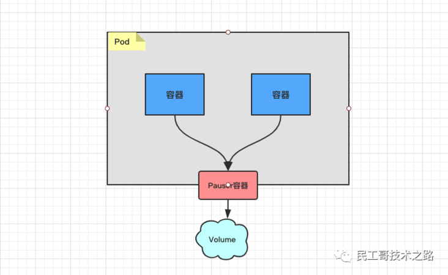

# pod介绍
> 1. 参考文章：https://bbs.huaweicloud.com/blogs/detail/156814
> 2. 参考文章：https://jimmysong.io/kubernetes-handbook/concepts/pause-container.html

# 第一部分  基本概念
## 1.1 Pod是什么

Pod是Kubernetes中能够创建和部署的最小单元，是Kubernetes集群中的一个应用实例，总是部署在同一个节点Node上。Pod中包含了一个或多个容器，还包括了存储、网络等各个容器共享的资源。Pod支持多种容器环境，Docker则是最流行的容器环境。

分类：
- 自主式pod： 不是由控制器管理的pod —— 死亡后无法被拉起
- 控制器管理的pod：受到控制器管理的pod

## 1.2 pod 启动的第一个容器 pause
Pause容器，又叫Infra容器。

我们知道在`kubelet`的配置中有这样一个参数：
```
KUBELET_POD_INFRA_CONTAINER=--pod-infra-container-image=registry.access.redhat.com/rhel7/pod-infrastructure:latest
```
上面是`openshift`中的配置参数，kubernetes中默认的配置参数是：
```
KUBELET_POD_INFRA_CONTAINER=--pod-infra-container-image=gcr.io/google_containers/pause-amd64:3.0
```
Pause容器，是可以自己来定义，官方使用的`gcr.io/google_containers/pause-amd64:3.0`容器的代码见Github，使用C语言编写。

### 1.2.1 Pause容器特点
- 镜像非常小，目前在700KB左右
- 永远处于Pause(暂停)状态
### 1.2.2 Pause容器背景
像 Pod 这样一个东西，本身是一个逻辑概念。那在机器上，它究竟是怎么实现的呢？这就是我们要解释的一个问题。

既然说 Pod 要解决这个问题，核心就在于如何让一个 Pod 里的多个容器之间最高效的共享某些资源和数据。

因为容器之间原本是被 `Linux Namespace` 和 `cgroups` 隔开的，所以现在实际要解决的是怎么去打破这个隔离，然后共享某些事情和某些信息。这就是 Pod 的设计要解决的核心问题所在。

**所以说具体的解法分为两个部分：`网络`和`存储`**。

Pause容器就是为解决Pod中的网络问题而生的。

### 1.2.3 Pause容器实现
Pod 里的多个容器怎么去共享网络？下面是个例子：

比如说现在有一个 Pod，其中包含了一个容器 A 和一个容器 B，它们两个就要共享 `Network Namespace`。在 Kubernetes 里的解法是这样的：它会在每个 Pod 里，额外起一个 `Infra container` 小容器来共享整个 Pod 的 Network Namespace。

**`Infra container` 是一个非常小的镜像，大概 700KB 左右，是一个C语言写的、永远处于“暂停”状态的容器。由于有了这样一个 `Infra container` 之后，其他所有容器都会通过 Join Namespace 的方式加入到 Infra container 的 Network Namespace 中。**

所以说一个 Pod 里面的所有容器，它们看到的网络视图是完全一样的。即：它们看到的网络设备、IP地址、Mac地址等等，跟网络相关的信息，其实全是一份，这一份都来自于 Pod 第一次创建的这个 `Infra container`。这就是 Pod 解决网络共享的一个解法。

**在 Pod 里面，一定有一个 IP 地址，是这个 Pod 的 Network Namespace 对应的地址，也是这个 Infra container 的 IP 地址**。所以大家看到的都是一份，而其他所有网络资源，都是一个 Pod 一份，并且被 Pod 中的所有容器共享。这就是 Pod 的网络实现方式。

**由于需要有一个相当于说中间的容器存在，所以整个 Pod 里面，必然是 Infra container 第一个启动。并且整个 Pod 的生命周期是等同于 `Infra container`的生命周期的，与容器 A 和 B 是无关的**。

**这也是为什么在 Kubernetes 里面，它是允许去单独更新 Pod 里的某一个镜像的，即：做这个操作，整个 Pod 不会重建，也不会重启，这是非常重要的一个设计**。

### 1.2.4 Pause容器的作用
kubernetes中的pause容器主要为每个业务容器提供以下功能：

- 在pod中担任Linux命名空间共享的基础；
- 启用pid命名空间，开启init进程。

个人理解 ：
- Pod 里的多个业务容器共享 Pause 容器的 IP 地址
- 共享 Pause 容器挂接的 Volume 资源。

  

## 1.3 Pod应用方式


- 单容器Pod，最常见的应用方式。
- 多容器Pod，对于多容器Pod，Kubernetes会保证所有的容器都在同一台物理主机或虚拟主机中运行。多容器Pod是相对高阶的使用方式，除非应用耦合特别严重，一般不推荐使用这种方式。一个Pod内的容器共享IP地址和端口范围，容器之间可以通过 localhost 互相访问

