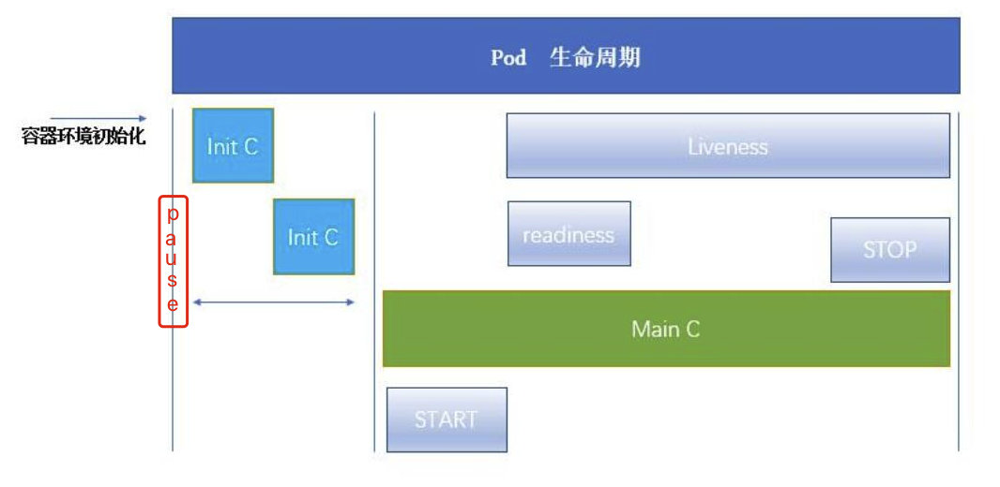

# pod 的生命周期-initC
> 1.https://kubernetes.io/zh/docs/concepts/workloads/pods/pod-lifecycle/



## 1. 什么是init C
这是一种专用的容器，在应用程序容器启动之前运行，用来包含一些应用镜像中不存在的实用工具或安装脚本

### 1.1理解 Init 容器
Pod 能够具有多个容器，应用运行在容器里面，但是它也可能有一个或多个先于应用容器启动的 Init 容器。

Init 容器与普通的容器非常像，除了如下两点：

- Init 容器总是运行到成功完成为止。
- 每个 Init 容器都必须在下一个 Init 容器启动之前成功完成。

**如果 Pod 的 Init 容器失败，Kubernetes 会不断地重启该 Pod，直到 Init 容器成功为止。然而，如果 Pod 对应的 restartPolicy 为 Never，它不会重新启动**。

### 1.2 与普通容器的不同之处
Init 容器支**持应用容器的全部字段和特性，包括资源限制、数据卷和安全设置**。 然而，Init 容器对资源请求和限制的处理稍有不同，在下面 资源 处有说明。 而且 Init 容器不支持 Readiness Probe，因为它们必须在 Pod 就绪之前运行完成。

如果为一个 Pod 指定了多个Init容器，那些容器会按顺序一次运行一个。只有当前面的 Init 容器必须运行成功后，才可以运行下一个 Init 容器。当所有的 Init 容器运行完成后，Kubernetes 才初始化 Pod 和运行应用容器。

### 1.3 Init 容器能做什么？
因为 Init 容器具有与应用程序容器分离的单独镜像，所以它们的启动相关代码具有如下优势：

- 它们可以包含并运行实用工具，但是出于安全考虑，是不建议在应用程序容器镜像中包含这些实用工具的。
它们可以包含使用工具和定制化代码来安装，但是不能出现在应用程序镜像中。例如，创建镜像没必要 FROM 另一个镜像，只需要在安装过程中使用类似 sed、 awk、 python 或 dig 这样的工具。
- 应用程序镜像可以分离出创建和部署的角色，而没有必要联合它们构建一个单独的镜像。
- Init 容器使用 Linux Namespace，所以相对应用程序容器来说具有不同的文件系统视图。因此，它们能够具有访问 Secret 的权限，而应用程序容器则不能。
- 它们必须在应用程序容器启动之前运行完成，而应用程序容器是并行运行的，所以 Init 容器能够提供了一种简单的阻塞或延迟应用容器的启动的方法，直到满足了一组先决条件。

### 1.4 具体行为：
1. 在 Pod 启动过程中，Init 容器会按顺序在网络和数据卷初始化之后启动。每个容器必须在下一个容器启动之前成功退出。
2. 如果由于运行时或失败退出，将导致容器启动失败，它会根据 Pod 的 restartPolicy 指定的策略进行重试。然而，如果 Pod 的 restartPolicy 设置为 Always，Init 容器失败时会使用 RestartPolicy 策略。

3. **在所有的 Init 容器没有成功之前，Pod 将不会变成 Ready 状态**。Init 容器的端口将不会在 Service 中进行聚集(防止还未初始化，就提供服务)。 **正在初始化中的 Pod 处于 Pending 状态**，但应该会将 Initializing 状态设置为 true。
4. 如果 Pod 重启，所有 Init 容器必须重新执行。
5. 对 Init 容器 spec 的修改被限制在容器 image 字段，修改其他字段都不会生效。更改 Init 容器的 image 字段，等价于重启该 Pod。
6. Init 容器具有应用容器的所有字段。除了 readinessProbe，因为 Init 容器无法定义不同于完成（completion）的就绪（readiness）之外的其他状态。这会在验证过程中强制执行。
7. 在 Pod 中的每个 app 和 Init 容器的名称必须唯一；与任何其它容器共享同一个名称，会在验证时抛出错误。

### 1.4 示例
> 参考 ： https://jimmysong.io/kubernetes-handbook/concepts/init-containers.html

必须发现service启动后，再启动本pod
```yaml
apiVersion: v1
kind: Pod
metadata:
  name: myapp-pod
  labels:
    app: myapp
spec:
  containers:
  - name: myapp-container
    image: busybox
    command: ['sh', '-c', 'echo The app is running! && sleep 3600']
  initContainers:
  - name: init-myservice
    image: busybox
    command: ['sh', '-c', 'until nslookup myservice; do echo waiting for myservice; sleep 2; done;']
  - name: init-mydb
    image: busybox
    command: ['sh', '-c', 'until nslookup mydb; do echo waiting for mydb; sleep 2; done;']
```
```YAML
kind: Service
apiVersion: v1
metadata:
  name: myservice
spec:
  ports:
    - protocol: TCP
      port: 80
      targetPort: 9376
---
kind: Service
apiVersion: v1
metadata:
  name: mydb
spec:
  ports:
    - protocol: TCP
      port: 80
      targetPort: 9377
```
结果：
```
$ kubectl get -f myapp.yaml
NAME        READY     STATUS     RESTARTS   AGE
myapp-pod   0/1       Init:0/2   0          6m
```

- READY： 还没有到 mainC 容器所以是 0
- STATUS： init 表示正在进行的 init C的容器 0/2 表示 正在进行 和 总共


---