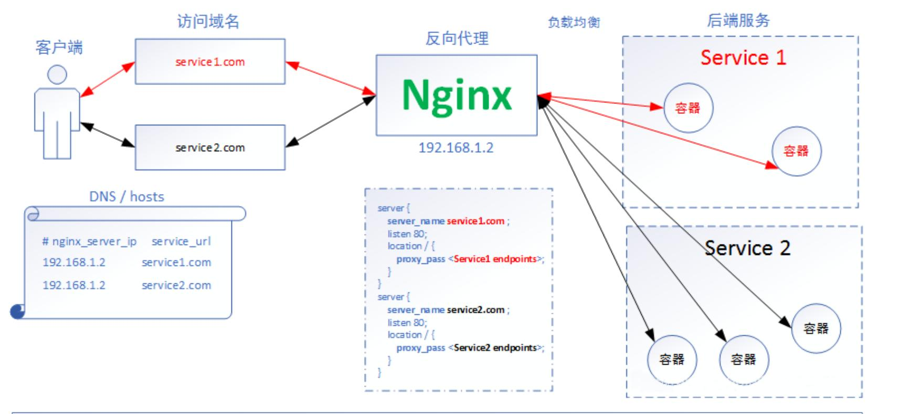
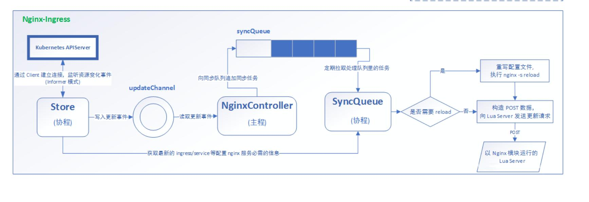

# 介绍ingress 解析
> 参考文章：https://jimmysong.io/kubernetes-handbook/concepts/ingress.html

## 什么是 Ingress？
通常情况下，service 和 pod 仅可在集群内部网络中通过 IP 地址访问。所有到达边界路由器的流量或被丢弃或被转发到其他地方。从概念上讲，可能像下面这样：
```
    internet
        |
  ------------
  [Services]
```
Ingress 是授权入站连接到达集群服务的规则集合。
```
    internet
        |
   [Ingress]
   --|-----|--
   [Services]
```
你可以给 Ingress 配置提供外部可访问的 URL、负载均衡、SSL、基于名称的虚拟主机等。用户通过 POST Ingress 资源到 API server 的方式来请求 ingress。 Ingress controller 负责实现 Ingress，通常使用负载均衡器，它还可以配置边界路由和其他前端，这有助于以高可用的方式处理流量。


## 2. Ingress 资源
最简化的 Ingress 配置如下。
```
1: apiVersion: extensions/v1beta1
2: kind: Ingress
3: metadata:
4:   name: test-ingress
5: spec:
6:   rules:
7:   - http:
8:       paths:
9:       - path: /testpath
10:        backend:
11:           serviceName: test
12:           servicePort: 80
```
如果你没有配置 Ingress controller 就将其 POST 到 API server 不会有任何用处。

## 3. Ingress controller
**为了使 Ingress 正常工作，集群中必须运行 Ingress controller。 这与其他类型的控制器不同，其他类型的控制器通常作为 kube-controller-manager 二进制文件的一部分运行，在集群启动时自动启动**。 你需要选择最适合自己集群的 Ingress controller 或者自己实现一个。

- Kubernetes 当前支持并维护 GCE 和 [nginx](https://github.com/kubernetes/ingress-nginx/blob/main/README.md) 两种 controller
- F5（公司）支持并维护 F5 BIG-IP Controller for Kubernetes
- Kong 同时支持并维护 社区版 与 企业版 的 Kong Ingress Controller for Kubernetes
- Traefik 是功能齐全的 ingress controller（Let’s Encrypt, secrets, http2, websocket…）, Containous 也对其提供商业支持。
- Istio 使用 CRD Gateway 来 控制 Ingress 流量。
  

## 4. ingress Nginx资料
- 官网 https://kubernetes.github.io/ingress-nginx/
- github： https://github.com/kubernetes/ingress-nginx




## 5 部署ingress nginx

```
kubectl apply -f https://raw.githubusercontent.com/kubernetes/ingress-nginx/controller-v0.48.1/deploy/static/provider/cloud/deploy.yaml
```

看清楚对应的版本 k8s  1.22.0 只能用alpha 版本
https://github.com/kubernetes/ingress-nginx/blob/controller-v1.0.0-alpha.2/deploy/static/provider/cloud/deploy.yaml