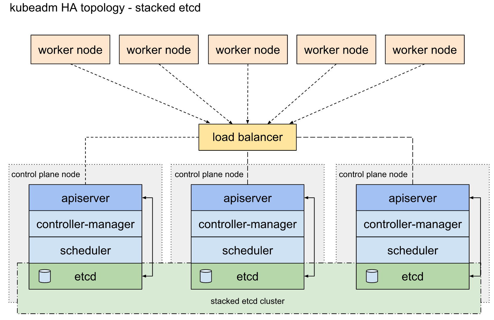
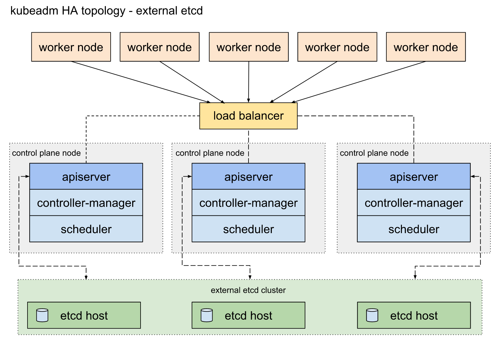

# 高可用部署 
https://www.kubernetes.org.cn/6964.html
https://www.cnblogs.com/leozhanggg/p/12697237.html


https://kubesphere.io/zh/docs/installing-on-linux/high-availability-configurations/set-up-ha-cluster-using-keepalived-haproxy/

## 1. 关键问题
根据K8s官方文档将HA拓扑分为两种，`Stacked etcd topology`（堆叠ETCD）和`External etcd topology`（外部ETCD）。 https://kubernetes.cn/docs/setup/production-environment/tools/kubeadm/ha-topology/#external-etcd-topology

### 1.1 堆叠ETCD: 
> 每个master节点上运行一个apiserver和etcd, etcd只与本节点apiserver通信。


### 1.2 外部ETCD: 
> etcd集群运行在单独的主机上，每个etcd都与apiserver节点通信。



官方文档主要是解决了高可用场景下apiserver与etcd集群的关系, 三master节点防止单点故障。但是集群对外访问接口不可能将三个apiserver都暴露出去，一个挂掉时还是不能自动切换到其他节点。官方文档只提到了一句“使用负载均衡器将apiserver暴露给工作程序节点”，而这恰恰是生产环境中需要解决的重点问题。

> **Notes: 此处的负载均衡器并不是kube-proxy，此处的Load Balancer是针对apiserver的**。

## 2 部署架构
以下是我们在生产环境所用的部署架构：


1. 由外部负载均衡器提供一个vip，流量负载到keepalived master节点上。
2. 当keepalived节点出现故障, vip自动漂到其他可用节点。
3. haproxy负责将流量负载到apiserver节点。
4. 三个apiserver会同时工作。
   - 注意k8s中controller-manager和scheduler只会有一个工作，其余处于backup状态。

## 3. haproxy
haproxy提供高可用性，负载均衡，基于TCP和HTTP的代理，支持数以万记的并发连接。https://github.com/haproxy/haproxy

haproxy可安装在主机上，也可使用docker容器实现。文本采用第二种。

创建配置文件/etc/haproxy/haproxy.cfg，重要配置以中文注释标出：

```
#---------------------------------------------------------------------
# Example configuration for a possible web application.  See the
# full configuration options online.
#
#   https://www.haproxy.org/download/2.1/doc/configuration.txt
#   https://cbonte.github.io/haproxy-dconv/2.1/configuration.html
#
#---------------------------------------------------------------------

#---------------------------------------------------------------------
# Global settings
#---------------------------------------------------------------------
global
    # to have these messages end up in /var/log/haproxy.log you will
    # need to:
    #
    # 1) configure syslog to accept network log events.  This is done
    #    by adding the '-r' option to the SYSLOGD_OPTIONS in
    #    /etc/sysconfig/syslog
    #
    # 2) configure local2 events to go to the /var/log/haproxy.log
    #   file. A line like the following can be added to
    #   /etc/sysconfig/syslog
    #
    #    local2.*                       /var/log/haproxy.log
    #
    log         127.0.0.1 local2

#    chroot      /var/lib/haproxy
    pidfile     /var/run/haproxy.pid
    maxconn     4000
#    user        haproxy
#    group       haproxy
    # daemon

    # turn on stats unix socket
    stats socket /var/lib/haproxy/stats

#---------------------------------------------------------------------
# common defaults that all the 'listen' and 'backend' sections will
# use if not designated in their block
#---------------------------------------------------------------------
defaults
    mode                    http
    log                     global
    option                  httplog
    option                  dontlognull
    option http-server-close
    option forwardfor       except 127.0.0.0/8
    option                  redispatch
    retries                 3
    timeout http-request    10s
    timeout queue           1m
    timeout connect         10s
    timeout client          1m
    timeout server          1m
    timeout http-keep-alive 10s
    timeout check           10s
    maxconn                 3000

#---------------------------------------------------------------------
# main frontend which proxys to the backends
#---------------------------------------------------------------------
frontend  kubernetes-apiserver
    mode tcp
    bind *:9443  ## 监听9443端口
    # bind *:443 ssl # To be completed ....

    acl url_static       path_beg       -i /static /images /javascript /stylesheets
    acl url_static       path_end       -i .jpg .gif .png .css .js

    default_backend             kubernetes-apiserver

#---------------------------------------------------------------------
# round robin balancing between the various backends
#---------------------------------------------------------------------
backend kubernetes-apiserver
    mode        tcp  # 模式tcp
    balance     roundrobin  # 采用轮询的负载算法
# k8s-apiservers backend  # 配置apiserver，端口6443
 server master-192.168.31.50 192.168.31.61:6443 check
 server master-192.168.31.50 192.168.31.62:6443 check
 server master-192.168.31.61 192.168.31.62:6443 check
```
分别在三个节点启动haproxy
```
docker run -d --name=diamond-haproxy -v /etc/haproxy/haproxy.cfg:/usr/local/etc/haproxy/haproxy.cfg:ro --net=host  haproxy:2.4.2
```

## 4. keepalived
**keepalived是以VRRP(虚拟路由冗余协议)协议为基础, 包括一个master和多个backup**。 master劫持vip对外提供服务。master发送组播，backup节点收不到vrrp包时认为master宕机，此时选出剩余优先级最高的节点作为新的master, 劫持vip。keepalived是保证高可用的重要组件。

keepalived可安装在主机上，也可使用docker容器实现。文本采用第二种。(https://github.com/osixia/docker-keepalived)

配置keepalived.conf, 重要部分以中文注释标出：
```
global_defs {
   script_user root 
   enable_script_security

}

vrrp_script chk_haproxy {
    script "/bin/bash -c 'if [[ $(netstat -nlp | grep 9443) ]]; then exit 0; else exit 1; fi'"  # haproxy 检测
    interval 2  # 每2秒执行一次检测
    weight 11 # 权重变化
}

vrrp_instance VI_1 {
  interface eth0

  state MASTER # backup节点设为BACKUP
  virtual_router_id 51 # id设为相同，表示是同一个虚拟路由组
  priority 100 #初始权重
nopreempt #可抢占

  unicast_peer {

  }

  virtual_ipaddress {
    10.53.61.200  # vip
  }

  authentication {
    auth_type PASS
    auth_pass password
  }

  track_script {
      chk_haproxy
  }

  notify "/container/service/keepalived/assets/notify.sh"
}
```
1. vrrp_script用于检测haproxy是否正常。如果本机的haproxy挂掉，即使keepalived劫持vip，也无法将流量负载到apiserver。
2. 我所查阅的网络教程全部为检测进程, 类似killall -0 haproxy。这种方式用在主机部署上可以，但容器部署时，在keepalived容器中无法知道另一个容器haproxy的活跃情况，因此我在此处通过检测端口号来判断haproxy的健康状况。
3. weight可正可负。为正时检测成功+weight，相当与节点检测失败时本身priority不变，但其他检测成功节点priority增加。为负时检测失败本身priority减少。
4. 另外很多文章中没有强调nopreempt参数，意为不可抢占，此时master节点失败后，backup节点也不能接管vip，因此我将此配置删去。
分别在三台节点启动keepalived:
```
docker run --cap-add=NET_ADMIN --cap-add=NET_BROADCAST --cap-add=NET_RAW --net=host --volume `pwd`/keepalived.conf:/container/service/keepalived/assets/keepalived.conf -d osixia/keepalived:2.0.19 --copy-service
```
查看keepalived master容器日志：
```
# docker logs cc2709d64f8377e8
Mon Mar 16 02:26:37 2020: VRRP_Script(chk_haproxy) succeeded # haproxy检测成功
Mon Mar 16 02:26:37 2020: (VI_1) Changing effective priority from 100 to 111 # priority增加
Mon Mar 16 02:26:41 2020: (VI_1) Receive advertisement timeout
Mon Mar 16 02:26:41 2020: (VI_1) Entering MASTER STATE
Mon Mar 16 02:26:41 2020: (VI_1) setting VIPs. # 设置vip 
Mon Mar 16 02:26:41 2020: Sending gratuitous ARP on eth0 for 10.53.61.200
Mon Mar 16 02:26:41 2020: (VI_1) Sending/queueing gratuitous ARPs on eth0 for 10.53.61.200
Mon Mar 16 02:26:41 2020: Sending gratuitous ARP on eth0 for 10.53.61.200
Mon Mar 16 02:26:41 2020: Sending gratuitous ARP on eth0 for 10.53.61.200
Mon Mar 16 02:26:41 2020: Sending gratuitous ARP on eth0 for 10.53.61.200
Mon Mar 16 02:26:41 2020: Sending gratuitous ARP on eth0 for 10.53.61.200
I'm the MASTER! Whup whup.
```
查看master vip:
```
# ip a|grep eth0
```
```
2: eth0: <BROADCAST,MULTICAST,UP,LOWER_UP> mtu 1500 qdisc pfifo_fast state UP group default qlen 1000
    inet 10.53.61.159/24 brd 10.53.61.255 scope global eth0
    inet 10.53.61.200/32 scope global eth0
```
可以看到vip已绑定到keepalived master

下面进行破坏性测试：

暂停keepalived master节点haproxy
```
docker stop $(docker ps -a | grep haproxy)
```
查看keepalived master日志
```
# docker logs cc2709d64f8377e8
Mon Mar 16 02:29:35 2020: Script `chk_haproxy` now returning 1
Mon Mar 16 02:29:35 2020: VRRP_Script(chk_haproxy) failed (exited with status 1)
Mon Mar 16 02:29:35 2020: (VI_1) Changing effective priority from 111 to 100
Mon Mar 16 02:29:38 2020: (VI_1) Master received advert from 10.53.61.195 with higher priority 101, ours 100
Mon Mar 16 02:29:38 2020: (VI_1) Entering BACKUP STATE
Mon Mar 16 02:29:38 2020: (VI_1) removing VIPs.
Ok, i'm just a backup, great.
```
可以看到haproxy检测失败，priority降低，同时另一节点10.53.61.195 priority 比master节点高，master置为backup

查看10.53.61.195 keepalived日志：
```
# docker logs 99632863eb6722
Mon Mar 16 02:26:41 2020: VRRP_Script(chk_haproxy) succeeded
Mon Mar 16 02:26:41 2020: (VI_1) Changing effective priority from 90 to 101
Mon Mar 16 02:29:36 2020: (VI_1) received lower priority (100) advert from 10.53.61.159 - discarding
Mon Mar 16 02:29:37 2020: (VI_1) received lower priority (100) advert from 10.53.61.159 - discarding
Mon Mar 16 02:29:38 2020: (VI_1) received lower priority (100) advert from 10.53.61.159 - discarding
Mon Mar 16 02:29:38 2020: (VI_1) Receive advertisement timeout
Mon Mar 16 02:29:38 2020: (VI_1) Entering MASTER STATE
Mon Mar 16 02:29:38 2020: (VI_1) setting VIPs.
Mon Mar 16 02:29:38 2020: Sending gratuitous ARP on eth0 for 10.53.61.200
Mon Mar 16 02:29:38 2020: (VI_1) Sending/queueing gratuitous ARPs on eth0 for 10.53.61.200
Mon Mar 16 02:29:38 2020: Sending gratuitous ARP on eth0 for 10.53.61.200
Mon Mar 16 02:29:38 2020: Sending gratuitous ARP on eth0 for 10.53.61.200
Mon Mar 16 02:29:38 2020: Sending gratuitous ARP on eth0 for 10.53.61.200
Mon Mar 16 02:29:38 2020: Sending gratuitous ARP on eth0 for 10.53.61.200
Mon Mar 16 02:29:38 2020: (VI_1) Received advert from 10.53.61.43 with lower priority 101, ours 101, forcing new election
Mon Mar 16 02:29:38 2020: Sending gratuitous ARP on eth0 for 10.53.61.200
Mon Mar 16 02:29:38 2020: (VI_1) Sending/queueing gratuitous ARPs on eth0 for 10.53.61.200
Mon Mar 16 02:29:38 2020: Sending gratuitous ARP on eth0 for 10.53.61.200
Mon Mar 16 02:29:38 2020: Sending gratuitous ARP on eth0 for 10.53.61.200
Mon Mar 16 02:29:38 2020: Sending gratuitous ARP on eth0 for 10.53.61.200
Mon Mar 16 02:29:38 2020: Sending gratuitous ARP on eth0 for 10.53.61.200
I'm the MASTER! Whup whup.
```
可以看到10.53.61.195被选举为新的master。
至此高可用实验完成，接下来就是使用kubeadm安装k8s组件，这里就不展开了。


## 最后改 初始化文件：
> 修改3处  （全部设置为 vip）


```YML
kubeadm config print init-defaults > kubeadm-init.yaml
vim /root/kubeadm-init.yaml
改为
apiVersion: kubeadm.k8s.io/v1beta2
bootstrapTokens:
- groups:
  - system:bootstrappers:kubeadm:default-node-token
  token: abcdef.0123456789abcdef
  ttl: 24h0m0s
  usages:
  - signing
  - authentication
kind: InitConfiguration
localAPIEndpoint:
  advertiseAddress: 192.168.3.200   #Vip的地址
  bindPort: 6443
nodeRegistration:
  criSocket: /var/run/dockershim.sock
  name: k8s-master1
  taints:
  - effect: NoSchedule
    key: node-role.kubernetes.io/master
---
apiServer:
  certSANs:
  - "192.168.3.200"      #Vip地址
  timeoutForControlPlane: 4m0s
apiVersion: kubeadm.k8s.io/v1beta2
certificatesDir: /etc/kubernetes/pki
clusterName: kubernetes
controllerManager: {}
dns:
  type: CoreDNS
etcd:
  local:
    dataDir: /var/lib/etcd
imageRepository: registry.cn-hangzhou.aliyuncs.com/google_containers    #aliyun地址
controlPlaneEndpoint: "192.168.3.200:8443"     #Vip地址和端口
kind: ClusterConfiguration
kubernetesVersion: v1.19.0
networking:
  dnsDomain: cluster.local
  serviceSubnet: 10.96.0.0/12
  podSubnet: 10.244.0.0/16        #pod网段
scheduler: {}
```